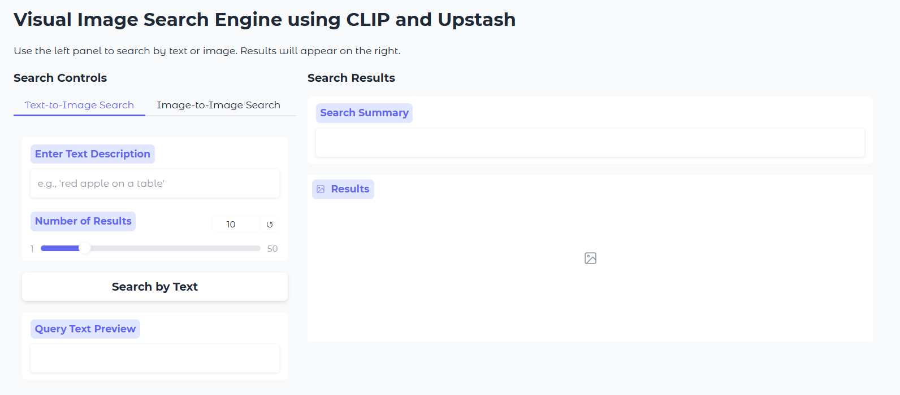
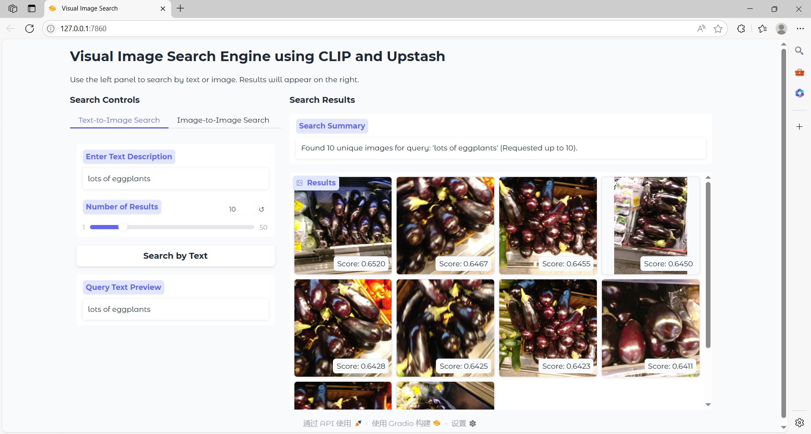
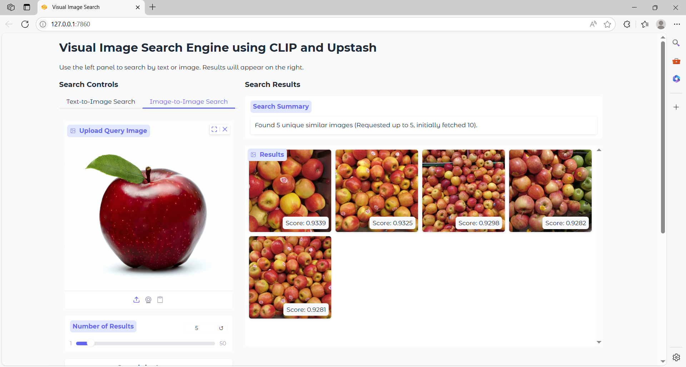
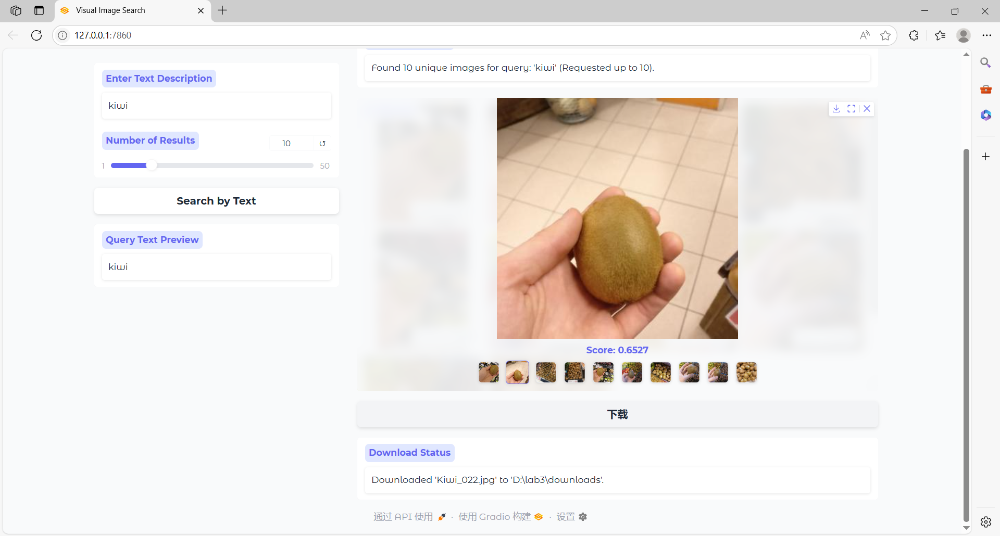

# CLIP Image-Text Search System

An image search system built on the CLIP (Contrastive Language-Image Pre-Training) model, supporting dual-modal search functionality including text-to-image and image-to-image search.

## Features

- **Text Search**: Find relevant images through natural language descriptions
- **Image Search**: Upload reference images to find visually similar pictures
- **Flexible Control**: Adjust the number of search results
- **Image Download**: Save discovered images with one click

## Environment Requirements

- Python 3.12+
- PyTorch
- Gradio
- Transformers (Hugging Face)
- Upstash Vector
- Other dependencies can be found in the import section of the code

## Dataset

The system uses the Grocery Store Dataset as an example dataset, containing various food and grocery item images. The system will automatically download and configure the dataset from GitHub during the first run.

## Configuration

1. Create a `.env` file in the project root directory with the following environment variables:

```url
UPSTASH_URL=https://known-marmoset-57107-us1-vector.upstash.io
UPSTASH_TOKEN=ABgFMGtub3duLW1hcm1vc2V0LTU3MTA3LXVzMWFkbWluTWpKallUYzJaVEV0TUdZd055MDBZVGN6TFRreE5EQXRPRGRtTkRNNE1URTNPVGhq
```

2. Ensure network connectivity is available, as the system will automatically download and set up the dataset during the first run.

## Usage

### Install Dependencies

Before running the system, ensure all required packages are installed. You can install them using pip:

```bash
pip install -r requirements.txt
```

### Starting the System

```python
python3 __main__.py
```

After startup, the system will open the Gradio interface in a browser (typically at http://127.0.0.1:7860).

### Text Search

1. Select "Text-to-Image Search"
2. Enter a description in the text box, such as "red apple" or "lots of bananas"
3. Adjust the "Number of Results" slider (default is 10)
4. Click the "Search by Text" button
5. The system will display images that best match your description
6. Click any result image to select it for download

### Image Search

1. Select "Image-to-Image Search"
2. Upload a reference image (supports drag-and-drop or click to upload)
3. Adjust the "Number of Results" slider
4. Click the "Search by Image" button
5. The system will display images that are visually similar to your uploaded image
6. Click any result image to select it for download

### Downloading Images

1. Click on any image in the search results
2. Click the "Download" button below
3. The image will be saved to the `downloads` folder in the project root directory
4. Download status will be displayed on the interface

## System Architecture

- **CLIP Model**: Provides a unified embedding space for text and images
- **Upstash Vector Database**: Stores pre-computed image embeddings
- **Gradio**: Provides an interactive user interface

## Notes

- The system needs to download the CLIP model and dataset during the first run, which may take some time
- All searches are based on visual semantic similarity, not traditional keyword matching
- The quality of search results depends on the CLIP model's understanding of the input
- Downloaded images are saved in the `downloads` folder in the project directory

## Screenshots





